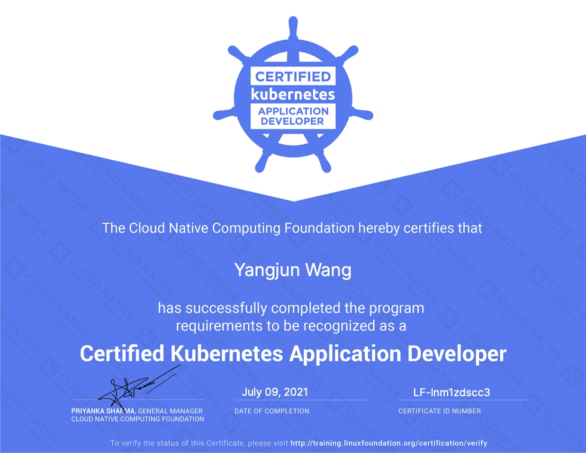

# Hi there, this is Yangjun Wang 👋
A full-stack software engineer with about 10 years working experience.  
Contact me if you have any opportunities or collaboration ideas.

- Tech stack:
  - React, Typescript/Javascript
  - Node.js, Golang, Java, Python
  - Postgres, MySQL
  - GCP, AWS, Kubernetes
- 🔭 I’m currently working on a FinTech project
  - **Backend**: Golang, GraphQL(gqlgen)，Postgres
  - **Frontend**: Typescript, React, Apollo-client, Tailwindcss
  - **DevOps**: AWS, Lambda, S3
- 🌱 I’m currently learning Web3 technologies
  - Ethers.js, Viem.js, Wagmi
  - Solidity, Hardhat
- 🤔 I’m looking for help with Web3 projects or mentorship
- 📫 How to reach me:
  - Email: yangjun.wang90@gmail.com

## Certificate

## 📊 GitHub Stats(public repositories):
 
 
